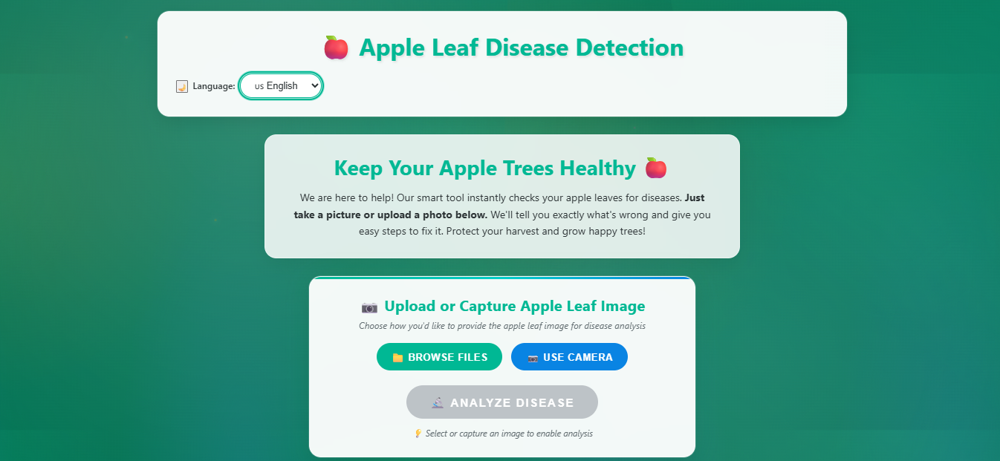
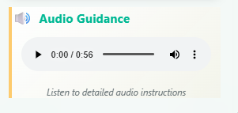
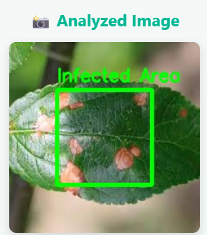

# 🍎 Apple Leaf Disease Detection & Infection Localization 🌿
## 📌 Project Overview
This project is a **Full Stack AI-based Web Application** that detects and analyzes diseases in apple leaves using Deep Learning.
The system uses:
* **MobileNetV2** → for disease classification
* **YOLOv8** → for detecting infected regions on the leaf
It provides results in:
* 📝 Text format
* 🔊 Audio format (based on user-selected language)
* 📦 Bounding boxes highlighting infected areas
---
## 🚀 Key Features
* 📷 Upload leaf image (Camera / File)
* 🤖 Disease classification using MobileNetV2
* 🎯 Infection detection using YOLOv8
* 📦 Bounding boxes on infected areas
* 🌐 Multi-language support (text + audio)
* 📊 Displays:
  * Disease name
  * Severity level
  * Description
  * Recommendations
---
## 🧠 Models Used
### 🔹 MobileNetV2 (Classification)
* Classifies leaf into:
  * Apple Scab
  * Black Rot
  * Cedar Apple Rust
  * Healthy
### 🔹 YOLOv8 (Detection)
* Detects infected regions
* Draws bounding boxes on affected areas
---
## 🔄 Workflow
1. User uploads an apple leaf image
2. Image is sent to Flask backend
3. Backend processes image:
   * MobileNetV2 → predicts disease
   * YOLOv8 → detects infected regions
4. Output generated:
   * Disease name
   * Severity
   * Description
   * Recommendations
5. Output displayed as:
   * 📝 Text
   * 🔊 Audio (user-selected language)
   * 📸 Image with bounding boxes
---
## 🛠️ Tech Stack
### Frontend:
* React.js / HTML / CSS / JavaScript
### Backend:
* Flask (Python)
### DL Models:
* TensorFlow / Keras (MobileNetV2)
* YOLOv8 (Ultralytics)
---
## 📁 Project Structure
apple_leaf_disease_detection/
│── backend/
│   ├── models/
│   │   ├── mobilenetv2_model.h5
│   │   ├── yolov8_model.pt
│   ├── static/
│   │   ├── audio/
│   ├── uploads/
│   ├── templates/
│   ├── app.py
│   ├── predict.py
│   ├── requirements.txt
│
│── frontend/
│   ├── src/
│   │   ├── App.js
│   │   ├── UploadCamera.js
│   ├── public/
│
│── README.md
```
---
## ⚙️ Installation & Setup
### 1️⃣ Clone the repository
git clone https://github.com/padma-12/apple-leaf-disease-detection.git
cd apple-leaf-disease-detection
```
### 2️⃣ Install backend dependencies
pip install -r requirements.txt
```
### 3️⃣ Run Flask backend
cd backend
python app.py
```
### 4️⃣ Run frontend
cd frontend
npm install
npm start
```
---
## 📸 Output Results

### 🖥️ User Interface
This shows the main interface where users upload the apple leaf image.


---

### 🔊 Audio Output
The system provides voice output based on the user-selected language.


---

### 📦 Infection Detection (Bounding Boxes)
YOLOv8 detects infected regions and highlights them with bounding boxes.


---

### 🌿 Disease Prediction & Recommendations
Displays disease name, severity, description, and recommended solutions.

---
## 🔮 Future Enhancements
* 📱 Mobile application
* ☁️ Cloud deployment
* 🌍 Multi-language expansion
* 📊 Real-time detection using camer
---
## 👩‍💻 Author
**Renuka (Padma)**
B.Tech CSE
---
## ⭐ Conclusion
This system helps in early detection of apple leaf diseases and provides actionable insights using AI, improving agricultural productivity.
